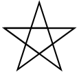
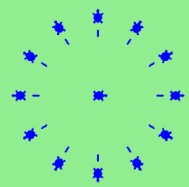

# tp3: turtle

## Ejercicio 1: Polígonos Regulares
Usa un bucle `for` para que una tortuga dibuje estos polígonos regulares (regular significa todos los lados y ángulos iguales):

- Un triángulo equilátero
- Un cuadrado
- Un hexágono (seis lados)
- Un octógono (ocho lados)

## Ejercicio 2: El Pirata Borracho
Un pirata borracho da vueltas al azar y luego avanza 100 pasos, gira otra cantidad aleatoria, avanza otros 100 pasos, gira otra cantidad aleatoria, y así sucesivamente. Un estudiante de la unrn registra el ángulo de cada giro. Sus datos experimentales son: [160, -43, 270, -97, -43, 200, -940, 17, -86] (ángulos positivos son en sentido antihorario). Usa una tortuga para dibujar el camino seguido por nuestro amigo borracho.

## Ejercicio 3: Rumbo del Pirata
Mejora el programa anterior para que también nos indique cuál es el rumbo del pirata borracho después de terminar de tambalearse. (Asume que comienza con rumbo 0).

## Ejercicio 4: Ángulo para Polígono de 18 Lados
Si fueras a dibujar un polígono regular de 18 lados, ¿qué ángulo necesitarías para girar la tortuga en cada esquina?

## Ejercicio 5: Predicción de Comandos
Copia y este código y en cada espera anticipa qué hará a continuación. Anotate un poroto con cada acierto, ¿cuántos porotos juntaste?

```python
import turtle
wn = turtle.Screen()
tess = turtle.Turtle()
tess.right(90)
input("adivina")
tess.left(3600)
input("adivina")
tess.right(-90)
input("adivina")
tess.speed(10)
tess.left(3600)
input("adivina")
tess.speed(0)
tess.left(3645)
tess.forward(-100)
```

## Ejercicio 6: Dibujar una Estrella
Escribe un programa para dibujar una forma como esta:



**Pistas:**
- Prueba esto en un papel, moviendo y girando tu teléfono como si fuera una tortuga. Observa cuántas rotaciones completas hace tu teléfono antes de completar la estrella. Como cada rotación completa son 360 grados, puedes calcular el número total de grados que giró tu teléfono. Si divides eso por 5 (porque la estrella tiene cinco puntas), sabrás cuántos grados girar la tortuga en cada punto.
- Puedes esconder una tortuga detrás de su capa de invisibilidad si no quieres que se muestre. Seguirá dibujando sus líneas si su lápiz está abajo. El método se invoca como `tess.hideturtle()`. Para hacer visible la tortuga nuevamente, usa `tess.showturtle()`.

## Ejercicio 7: Dibujar una Cara de Reloj
Escribe un programa para dibujar la cara de un reloj que se parezca a esto:




## Ejercicio 8: Tipo de Variable
Crea una tortuga y asígnala a una variable. Cuando preguntas por su tipo, ¿qué obtienes?
